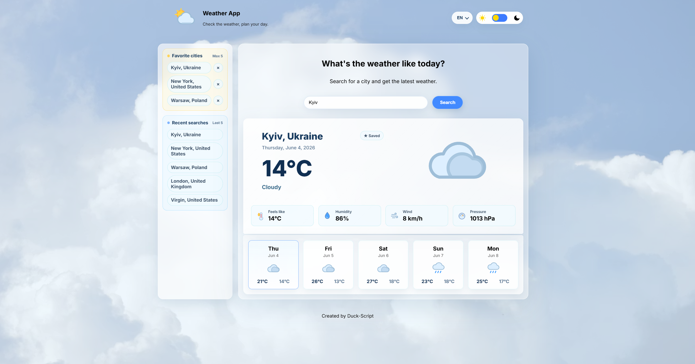
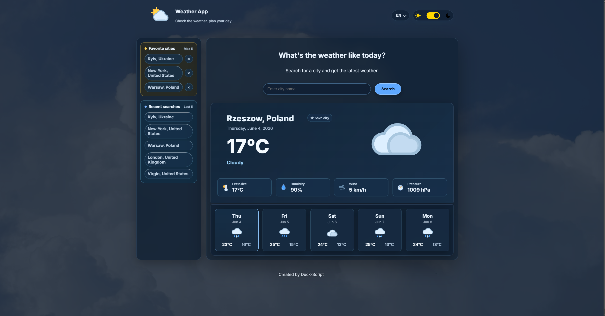

# Weather App

A responsive weather application built with HTML, CSS, and JavaScript.

Working with an API, rendering dynamic data, handling user input, saving data locally, and building a clean UI that feels close to a real small product.

## Live Demo

[Click here: Weather App](https://duck-script.github.io/Weather-App/)

## Screenshots

### Light Theme



### Dark Theme



## Features

- Search weather by city name, including a few common multilingual aliases
- Current weather data from Open-Meteo API
- 5-day forecast
- Dynamic weather icons
- Light and dark theme
- Theme saved in localStorage
- Browser theme detection
- Favorite cities panel
- Recent searches history
- City autocomplete suggestions
- Multi-language UI
- Weather-based background
- Time-aware sky background
- Current clock and local weather time
- Duck Mode easter egg
- Small localStorage cache
- API cooldown and friendly error states
- Loading and error states
- Responsive glassmorphism interface

## Technologies Used

- HTML5
- CSS3
- JavaScript
- Open-Meteo API
- LocalStorage
- Git
- GitHub

## How to Run Locally

1. Clone the repository:

```bash
git clone https://github.com/Duck-Script/Weather-App.git
```

2. Open the project folder:

```bash
cd Weather-App
```

3. Open `index.html` in your browser.

## Project Status

The project is in its final portfolio polish stage. The main features are working.

## Author

Created by **Duck-Script**

GitHub: [@Duck-Script](https://github.com/Duck-Script)
